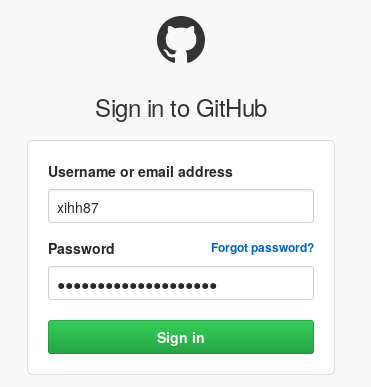
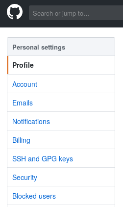
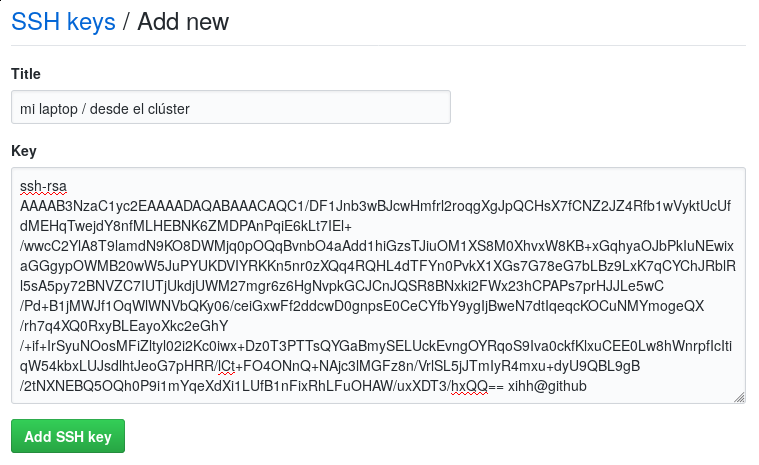
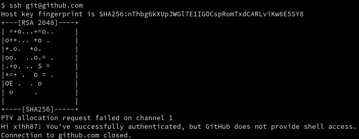
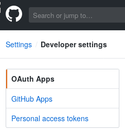
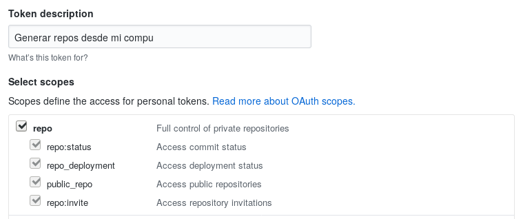

# Configurar github para usarlo más fácil

## Podemos generar una clave pública para GitHub

    ssh-keygen -t rsa -b 4096 -C `whoami`@github -f ~/.ssh/github

## Para configurar la llave tenemos que iniciar sesión

## Entramos a la configuración de usuario para agregar la llave

## Agregamos una nueva llave ssh para entrar a github sin contraseña

## Verificamos que funciona nuestra conexión a github

    ssh -i ~/.ssh/github git@github.com

## Podemos agregar un token para generar repositorios desde nuestra línea de comandos

 
 
 

## Configuramos nuestra computadora para conocer nuestros usuarios

    $ git config --global github.user  jpitayas
    $ git config --global github.token  fe51d55e77f349040656ac82af6c820859bff42a

## Agregamos este script para poder subir reposiorios nuevos de manera muy sencilla

    $ mkdir ~/bin
    $ cd ~/bin
    $ wget https://github.com/INMEGEN/taller.supercomputo/raw/master/scripts/github-create

## Si no tenemos la carpeta `~/bin` en nuestro PATH hay que configurarlo

    $ nano ~/.bash_profile # mac
    $ nano ~/.bashrc # linux y windows (muy probablemente no es necesario)

## Ya podemos subir repositorios nuevos a GitHub

    $ cd mi-proyecto
    $ git remote rename origin viejito
    $ github-create

## Intentemos con un repositorio real

Ejercicio:

1.  Generar un nuevo repositorio de git.
2.  Documentar un problema en el que estemos trabajando y hacer un
    commit.
3.  Usar `github-create` para subir el nuevo repositorio a GitHub.
