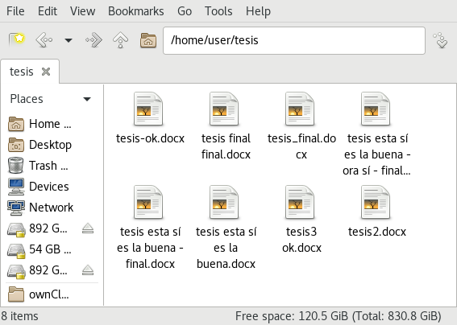
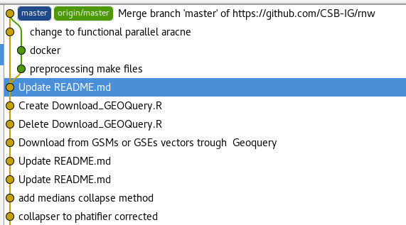
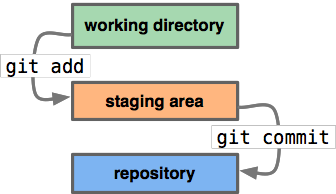
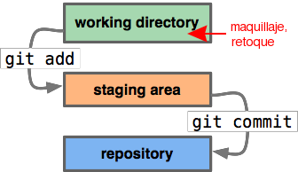

## Así como en el laboratorio es importante llevar una bitácora, es importante documentar qué hacemos en el análisis

## Lo primero que debemos escribir de cada proyecto es el objetivo, de dónde sale nuestra información y toda la información relevante

  - Diseño del experimento

  - Origen y tratamiento de la información

  - Referencias

## Y luego trabajamos paso a paso para lograr lo que queremos

  - El camino nunca es directo

  - Muchas cosas no funcionan como esperamos

  - Los objetivos cambian con respecto de lo que vamos
encontrando

## El control de versiones nos permite manejar estos cambios en los proyectos

## Y nos permite recuperar nuestro trabajo cuando se borra

# ¿Cómo funciona?

## Git toma fotos de tu trabajo

## Podemos considerar git un estudio fotográfico

  

## El directorio de trabajo es donde retocamos el trabajo

  

## Y existe un escenario donde podemos ver lo que vamos a guardar

  

## Y hay un álbum fotográfico donde podemos consultar las versiones del trabajo

  

# Usar git

## Tenemos que decirle a nuestros colaboradores nuestro nombre y correo

Si no hemos usado git nunca:

    git config --global user.name 'Juan de las Pitayas'
    git config --global user.email 'jpitayas@correo.com'
    git config --global merge.tool meld

## Podemos hacer un repositorio de git en cualquier carpeta usando el comando `git init`

Generar un repo desde cero:

    git init

Así generamos “el estudio fotográfico” del
proyecto.

## Para guardar archivos, primero hay que agregarlos al escenario con `git add`

Escribimos y retocamos…

…cuando estemos conformes:

    git add archivo [...]

## Podemos ver las cosas que se van a guardar usando `git diff --cached`

Ver “el escenario”:

    git diff --cached

## Podemos ver las cosas que aún no se han guardado con `git diff`

Ver qué se hizo “en la sala de espera”:

    git diff

## Y finalmente guardamos la foto de nuestro trabajo con `git commit`

Tomar la
foto:

    git commit

## Para ver las distintas versines de lo que hemos trabajado se utiliza `git log --cc`

Ver el
álbum:

    git log --cc

## Para volver a una versión anterior de todo nuestro directorio de trabajo, usamos `git checkout`

    git checkout version

## `git checkout` también puede ayudarnos a recuperar una parte específica de nuestro trabajo

    git checkout version -- archivo

## Para llevar varias versiones de nuestro trabajo, necesitamos darle un nombre a cada una

`git branch` muestra las distintas versiones de nuestro trabajo que
tienen
nombre

    git branch

## Como es muy común querer una versión del trabajo que se derive de otra existe un atajo para juntar checkout y branch

    git checkout -b nombre version

## Estos atajos nos permiten escribir comandos de git comunes más rápido

Agregar a `~/.bashrc`:

    alias gs="git status"
    alias gd="git diff"
    alias gdc="git diff --cached"
    alias gc="git commit"
    alias gcm="git commit -m"
    alias ga="git add"
    alias gp="git push"
    alias gb="git branch"
    alias gl="git log"
    alias glc="git log --cc"

## Existen plataformas para compartir nuestro trabajo

Compartir el álbum:

    git remote add [nombre] [URL]
    git push [nombre]

## Podemos copiarle las fotos a otro álbum de fotos que ya esté más trabajado

Comparar el álbum con otro y copiarle las
fotos:

    git pull [nombre] (rama)

## Podemos subir nuestra clave pública a github y entonces guardar cambios sin escribir la contraseña

Generar un par de llaves:

    ssh-keygen \
        -t rsa \
        -b 4096 \
        -C "`whoami`@`hostname`" \
        -f ~/.ssh/github

Y subirlas a github.com.

## Esta es una historia real…

  

## Esto también pasa

  

## Saber más

  - [Tutorial de
    atlassian](https://www.atlassian.com/git/tutorials/learn-git-with-bitbucket-cloud/create-the-repository)  
    <https://www.atlassian.com/git/tutorials/learn-git-with-bitbucket-cloud/create-the-repository>

  - [Listado de
    tutoriales](http://sixrevisions.com/resources/git-tutorials-beginners/)  
    <http://sixrevisions.com/resources/git-tutorials-beginners/>

  - [Una propuesta de flujo de trabajo con
    ramas](http://nvie.com/posts/a-successful-git-branching-model/)  
    <http://nvie.com/posts/a-successful-git-branching-model/>
