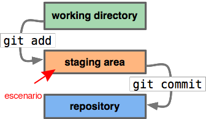

% Uso básico de git {height="3cm"}
% Joshua Haase
% 2016-10-17 - INMEGEN

# ¿Por qué git?

## ¿Por qué necesitamos un control de versiones?


---

## ¿Por qué necesitamos un control de versiones?


# ¿Cómo funciona?

## Git toma fotos de tu trabajo


---

## El estudio fotográfico

\
{height="4cm"}

---

## El estudio fotográfico

\
{height="4cm"}

----

## El estudio fotográfico

\
{height="4cm"}

----

## El estudio fotográfico

\
{height="4cm"}

# Usar git

---

## Instalar git (y amigos)

```
sudo apt install git git-flow gitg meld fish
```

---

## Adquirir fama y gloria

Si no hemos usado git nunca:

```
git config --global user.name 'Joshua Haase'
git config --global user.email 'jihaase@inmegen.gob.mx'
git config --global merge.tool meld
```

---

## Usar git

Generar un repo desde cero:

```
git init
```

Así generamos "el estudio fotográfico" del proyecto.

---

## Usar git

Escribimos y retocamos...

...cuando estemos conformes:

```
git add archivo [...]
```

---

## Usar git

Ver qué se hizo "en la sala de espera":

```
git diff
```

---

## Usar git

Ver "el escenario":

```
git diff --cached
```

---

## Usar git

Tomar la foto:

```
git commit
```

---

## Usar git

Ver el álbum:

```
git log --cc
```

---

## Usar git

Compartir el álbum:

```
git remote add [nombre] [URL]
git push [nombre]
```

---

## Usar git

Comparar el álbum con otro y copiarle las fotos:

```
git pull [nombre] (rama)
```

---

## Usar git

Puedes regresar a versiones anteriores de tu trabajo:

```
git checkout [commit]
```

---

## Vivir sin preocupaciones

Generar un par de llaves:

```
ssh-keygen \
	-t rsa \
	-b 4096 \
	-C "`whoami`@`hostname`" \
	-f ~/.ssh/github
```

Y subirlas a github.com.

---

## Vivir sin preocupaciones

Agregar a `~/.bashrc`:

```
alias gs="git status"
alias gd="git diff"
alias gdc="git diff --cached"
alias gc="git commit"
alias gcm="git commit -m"
alias ga="git add"
alias gp="git push"
alias gb="git branch"
```

---

## Vivir sin preocupaciones

Agregar a `~/.bashrc`:

```
alias gl="git log"
alias glc="git log --cc"
```

---

## Esta es una historia real...

\


---

## Esto también pasa

\


---

## Saber más

- [Tutorial de atlassian](https://www.atlassian.com/git/tutorials/learn-git-with-bitbucket-cloud/create-the-repository ) \
    <https://www.atlassian.com/git/tutorials/learn-git-with-bitbucket-cloud/create-the-repository>

- [Listado de tutoriales](http://sixrevisions.com/resources/git-tutorials-beginners/ ) \
    <http://sixrevisions.com/resources/git-tutorials-beginners/>

- [Una propuesta de flujo de trabajo con ramas](http://nvie.com/posts/a-successful-git-branching-model/ ) \
    <http://nvie.com/posts/a-successful-git-branching-model/>
