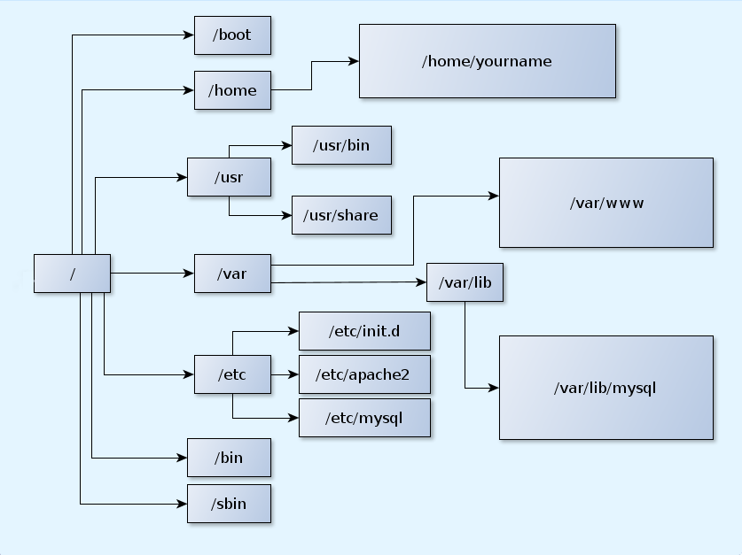
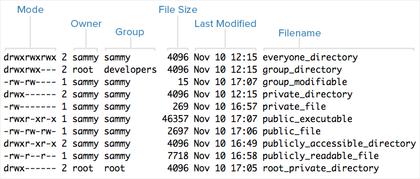

# Interface de línea de comandos


## Preámbulo

¡Vamos a conectarnos @ROGUE1!

1. Abre la terminal si estás en GNU/Linux o MacOSX o PuTTY si estás en Windows.

2. Conéctate a esta dirección IP:

```
192.168.105.221
```

  - En GNU/Linux y MacOSX teclea:

```
$ ssh <usuario>@castillo
```

o

```
$ ssh <usuario>@192.168.105.221
```

    
Teclea tu contraseña (parecerá que no se está escribiendo nada) y da enter de nuevo


  - En Windows abre PuTTY pon el IP en el campo que dice "Host Name (or IP address)" 
    - Clickea en "Open".  
    - Luego teclea tu nombre de usuario, da enter 
    - Teclea tu contraseña (parecerá que no se está escribiendo nada) y da enter de nuevo.

####¡Ya estas usando el Clúster del INMEGEN!

## ¿Qué es una linea de comandos?

La **[Interface de línea de comandos](http://en.wikipedia.org/wiki/Command-line_interface)** (CLI) es un **método para interactuar** con un programa o sistema operativo de computadora que permite al usuario dar órdenes al programa **en forma de lineas de texto** sucesivas (líneas de comando). 

La **CLI** es menos usada por el usuario de computadoras promedio que prefiere usar una **[Interface Gráfica de Usuario](http://en.wikipedia.org/wiki/Command-line_interface)** (GUI) que ofrece una estética mejorada y una mayor simplificación, a costa de un mayor consumo de recursos computacionales, y, en general, de una reducción de la funcionalidad alcanzable.

La **CLI**, sin embargo, es preferida por los usuarios avanzados de cómputo dado que ofrece medios más concisos y poderosos para controlar programas o sistemas operativos.

Las órdenes dadas al Shell de linea de comandos comúnmente tiene alguna de las siguientes sintaxis:

+ *hazAlgo -como archivoDestino*
+ *hazAlgo -como archivoFuente archivoDestino*
+ *hazAlgo -como <archivoEntrada> archivoSalida*
+ *hazAlgo -como | hazOtraCosa -como | hazAlgoMas -como > archivoSalida*

## Comandos básicos en UNIX

Copia y pega uno por uno los siguientes comandos mientras explico:


***ls*** (list) es un programa para listar el contenido de la carpeta en la que estamos "parados".

```
$ ls
```
```
$ ls -la
```
***cd*** (change directory) es un programa para cambiar de directorio dentro del árbol de directorios del sistema.

```
$ cd
```

***pwd*** (print working directory) es un pequeño programa que imprime en pantalla la ruta hacia el directorio donde estamos trabajando.

```
$ pwd
```

***find*** (encontrar) Es un programa que te muestra la estructura de archivos de la carpeta deseada y te permite filtrar el resultado para encontrar carpetas o archivos.

```
$ find
```

  - Comando para abortar una tarea `Ctrl` + `C`

```
$ find /
```


### Estructura de archivos

En los sistemas UNIX los archivos están organizados por directorios. Los directorios son archivos especiales que contienen información que permite localizar otros archivos en los dispositivos de almacenamiento. Los directorios pueden contener a su vez otros directorios los cuales se denominan subdirectorios. A la estructura resultante de esta organización se le conoce como *estructura de árbol invertido*.



   - Directorio raíz o *root* `/`: Es aquel directorio que está sobre todos los directorios. 

```
$ ls /
```
   
   - Directorio de coneccion `~`:  Es un directorio especial que representa el directorio principal de casa usuario. 

```
$ cd
$ ls
$ cd /
$ ls ~
$ cd ~
$ ls
```

   - Directorio de trabajo `.`: El punto representa el directorio en el que estamos parados

```
$ ls .
```

   - Directorio superior `..`: Dos puntos representa el directorio arriba del que estamos parados

```
$ ls ..
$ cd ..
$ ls 
```

  - Listado en formato largo con `ls -l`:



  - Permisos de archivos

  


***mkdir*** (make directory) crea carpetas.

```
$ cd
$ mkdir datos.taller
```
```
$ cd datos.taller
```
```
$ ls
```
***wget*** (www get) Es un programa para descargar archivos de internet.

```
$ wget "https://raw.githubusercontent.com/INMEGEN/taller.supercomputo/master/data/alumnos.txt"
```


```
$ ls
```
***cat*** (concatenate) sirve para concatenar archivos uno tras.

```
$ cat alumnos.txt
```

***less*** es un paginador para ver archivos.

```
$ less alumnos.txt
```

Dentro de `less` puedes usar el comando `/` para buscar tu nombre por ejemplo.

Para salir de `less` preciona la tecla `Q` 

***man*** (manual) es un programa que muestra los manuales de los programas.

```
$ man less
```
Las páginas de manuales son documentación acerca de los comandos y programas que tiene el sistema. Tienen una estructura constante lo que nos ayuda a ubicar la información que necesitamos más facilmente.

```
$ less -S alumnos.txt
```
***cut*** Corta por columnas un archivo.

```
$ cut -f1 alumnos.txt
```
**|**  ( **pipe** o tubería ) es un método para encadenar programas de tal modo que la salida de uno es la entrada del que sigue. Se usa una barra vertical para separar los programas a usar.

```
$ cut -f1 alumnos.txt | less
```

Las pipes (o tuberías) son una de las herramientas más poderosas de la interface de linea de comandos. Nos permite operar con diferentes herramientas sobre un mismo conjunto de información sin modificar el archivo que contiene nuestros datos.


***sort*** ordena listas.

```
$ sort alumnos.txt | less -S
```


``` 
$ cut -f1 alumnos.txt | sort | less
```

***tail*** (final) muestra el final de un archivo.

```
$ tail alumnos.txt | less -S
```


```
$ tail  -n +2 alumnos.txt | less -S
```

```
$ cut -f1 alumnos.txt | tail  -n +2 | less
```


```
$ cut -f1 alumnos.txt | tail  -n +2 | sort | less
```


***sed*** (stream editor) sed es un poderoso programa que sustituye caracteres en archivos de texto.

```
$ sed -e 's/Female/MUJER/' alumnos.txt | less -S
```

```
$ cut -f1,4 alumnos.txt | tail  -n +2 | sort | less
```

```
$ cut -f1,4 alumnos.txt | tail  -n +2 | sort | sed -e 's/Female/Mujer/' | less
```

```
$ cut -f1,4 alumnos.txt | tail  -n +2 | sort | sed -e 's/Female/Mujer/' -e 's/Male/Hombre/' | less
```

***>*** salva a archivo la salida estándar.

``` 
$ cut -f1,4 alumnos.txt | tail  -n +2 | sort | sed -e 's/Female/Mujer/' -e 's/Male/Hombre/' > alumnos_col_1_4.txt
```

```
$ ls
```


```
$ less alumnos_col_1_4.txt
```

***uniq*** busca repetidos en una lista ordenada.

```
$ uniq alumnos_col_1_4.txt |less
```

```
$ cut -f2 alumnos_col_1_4.txt | less
```

```
$ cut -f2 alumnos_col_1_4.txt | uniq
```

uniq requiere que los renglones estén ordenados ya que detecta renglones contiguos.

```
$ cut -f2 alumnos_col_1_4.txt | sort | uniq
```

```
$ cut -f2 alumnos_col_1_4.txt | sort | uniq -c 
```

***wc*** (word count) cuenta el número de palabras y de renglones.

```
$ wc alumnos_col_1_4.txt alumnos.txt
```

```
$ wc -l alumnos_col_1_4.txt alumnos.txt
```

```
$ cut -f2 alumnos_col_1_4.txt | wc -l
```

```
$ cut -f2 alumnos_col_1_4.txt | sort -u | wc -l
```


***grep*** (get all lines matching the regular expression and print (g/re/p)) es una herramienta muy poderosa para buscar cadenas de texto dentro de un archivo. Está pensado para trabajar con expresiones regulares (que no trataremos en este curso).

```
$ grep "Paulina" alumnos.txt
```
```
$ grep "^Paulina" alumnos.txt
```

```
$ grep "José" alumnos_col_1_4.txt
```

```
$ grep "José" alumnos_col_1_4.txt | wc -l
```

```
$ grep "José" alumnos_col_1_4.txt > pepes.txt
```

```
$ cat pepes.txt
```
```
$ cat alumnos_col_1_4.txt pepes.txt
```

***paste*** (pegar) pega columnas una contigua a la otra

```
$ paste alumnos_col_1_4.txt pepes.txt | less
```

```
$ paste alumnos_col_1_4.txt alumnos_col_1_4.txt | less
```

***mv*** (move) comando que sirve para mover o renombrar y archivo o carpeta.

```
$ ls -l
```


```
$ mv pepes.txt joseses.txt
```

```
$ ls -l
```

```
$ cat joseses.txt
```

```
$ mv joseses.txt ..
```
```
$ ls 
$ ls ..
$ cd ..
```


[Lista de comandos de UNIX en la Wikipedia](http://en.wikipedia.org/wiki/List_of_Unix_commands)

