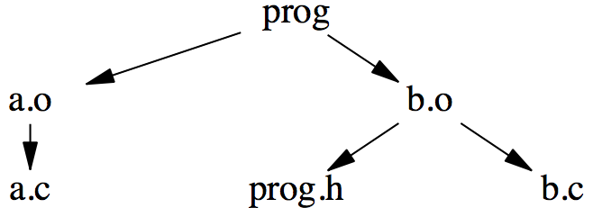
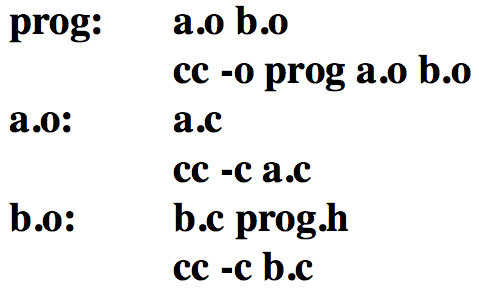
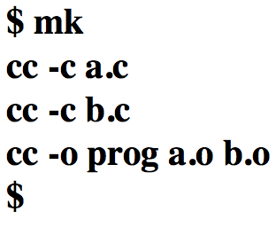
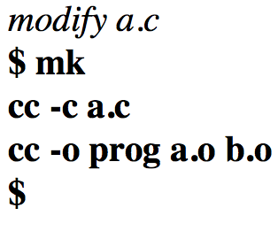
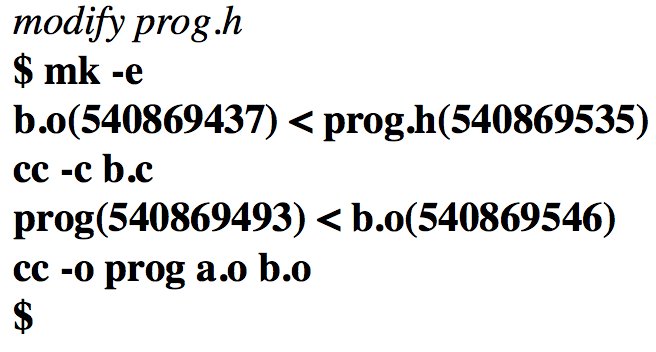
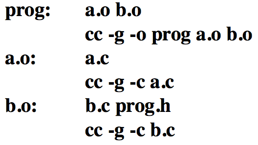
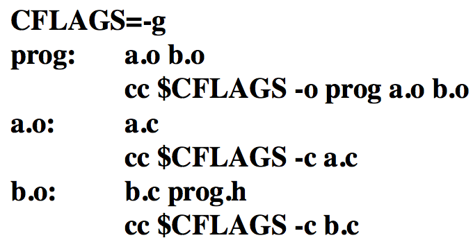
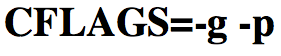
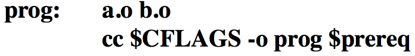
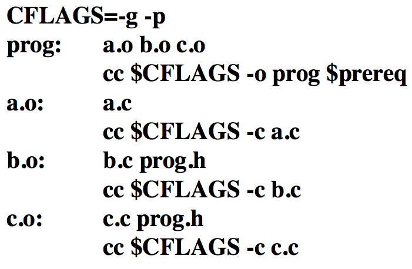

# mk


[*Mk*](https://swtch.com/plan9port/man/man1/mk.html) es una herramienta general y eficiente para describir y mantener dependencias entre archivos y programas. Mk es compatible y hecha al estilo de la herramienta de UNIX *make*. Las ventajas más importantes de mk sobre make es que ejecuta recetas en paralelo, usando metareglas de emparejado de patrones más que reglas de transformación de sufijos, y de resolucion de dependencias por cierre transitivo de todas las reglas.

### Receta básica

Dado que mk está basado en make y make es un programa para instalar programas, vamos a ejemplificar mk con la instalación de un programa que, en este caso se llamará **prog**. Digamos que **prog** se hace a partir de **a.o** y **b.o**, los cuales a su vez se hacen al compilar **a.c** y **b.c** respectivamente. Además **b.c** incluye un archivo de cabecera **prog.h**. Representamos estas relaciones esquemáticamente como sigue: 



Las flechas significan "depende de". Por tanto **porg** dende de si **a.o** y **b.o** se modifcian y, si **a.o** y **b.o** cambian, entonces **prog** debe ser hecho de nuevo. Igualmente, **a.o** depende de **a.c** y **b.o** depende de **b.c** y de **prog.h**.

La descripción en texto de como se hace **prog** se escribe en el *mkfile* y se vería así:



El mkfile es una secuencia de *reglas*. Cada regla define un objetivo (*tarjet*. Por ejemplo **prog**.) estos dependen de algunos prerequisitos (**a.o** y **b.o**) y los comandos (un script de shell llamado *receta*) para mantener el target actualizado. *Mk* toma esta descripción de un archivo llamado **mkfile** y contruye los targets indicados. Si en la linea de comandos no se indican tarjets se hace el primer tarjet del mkfile. Por ejemplo, si ejecutamos solo con las fuentes de nuestros archivos en nuestro directorio, *mk* creará **prog** compilando **a.c** y **b.c**.



Ejecutando *mk* de nuevo se hará nada, ya que **prog** estará actualizado.


Si cambiamos un archivo fuente, *mk* solo reconstruirá aquellos archivos que no están actualizados.



*Mk* puede explicar porque está reconstruyendo un archivo si usamos la opción **-e**. Por ejemplo



Esto es, **b.o** estaba desactualizado con respecto a **prog.h**. Después de que **b.o** fue re hecho, se encontró que **prog** estaba desactualizado con respecto a **b.o** y fue re hecho. Los números son las fechas de modificación de los archivos: los valores no son tan importantes como la diferencia entre ellos. Una fecha de modificación de cero indica un archivo que no existe.

### Variables

Supongamos ahora que necesitamos añadir una opción en todos los pasos, por ejemplo necesitamos la opción **-g**. Por demos simplemente editar cada paso para cambiar **c** a **cc -g**:



Una mejor solución es unas una *variable*. En *mk* una variable tiene una forma muy similar a una variable de shell. Un nombre conveniente (mnemotécnico) sería **CFLAGS**. El nuevo mkfile se vería así:



Ahora, si quieremos añadir más opciones a todos los pasos (digamos añadir la opción **-p**) necesitamos solo cambiar la primer línea a

 

y recompilar todos los objetos de nuevo. La forma facil de hacer esto es con **mk -a** lo que quiere decir "has todo de nuevo sin importar la fecha de modificación".

Algunas variables ya están incluidas por *mk* para ser usadas en las fórmulas. Dos muy comunes son **prereq** y **target** cuyo valor siempre será todos los prerequicitos de la regla y el objetivo de la mismo respectivamente. Podemos entonces reescribir la primera reglas así:

 

Así se puede garantizar que los prerequicitos de cada regla son los mismos. Ahora es facil incorporar un nuevo requicito , por ejemplo **c.o** añadiendo el nuevo nombre una sola vez.



### Ejercicio

Hagamos una *mk*. Vamos a suponer que tenemos unos archivos *fastq* que queremos alinear con **BWA**.


Primero entremos al cluster con nuestra cuenta de alumno. Las instrucciones [aquí](./ssh.md).

Entramos a byobu

```
$ byobu
```

hacemos una carpeta donde va a vivir nuestro mk y entramos

```
$ mkdir mk_bwa
$ cd mk_bwa
```

Hacemos una liga simbólica de nuestros datos a la carpeta del mk

```
$ ls -lah /castle/alumno70/data.alignment/
$ ln -s /castle/alumno70/data.alignment data
$ ls -lah data/
```

¿Cómo alinearíamos una muestra?

```
$ bwa mem \
	-t 2 \
	/reference/ftp.broadinstitute.org/bundle/hg38/Homo_sapiens_assembly38.fasta \
	/data/MT1_L001_R1.fastq.gz \
	/data/MT1_L001_R2.fastq.gz \
	> MT1.sam 	
```

Nuestra recera sería:

```
NPROC=1 # This program uses threads, so we use only one process
THREADS=2
REFERENCE=/reference/ftp.broadinstitute.org/bundle/hg38/Homo_sapiens_assembly38.fasta

results/bwa_align/%.sam:	data/%_L001_R1.fastq.gz data/%_L001_R2.fastq.gz
	mkdir -p `dirname $target`
	bwa mem \
		-t $THREADS \
		$REFERENCE \
		$prereq \
		> $target
```

entonce hay que copiar esta receta en un archivo llamado *mkfile*

```
$ nano mkfile
```


De esta forma si queremos hacer el sam de la primera secuencia tenemos que hacer

```
$ mk results/bwa_align/MT1.sam
```

Pero queremos que nos los haga todos a la vez. ¿Se acuerdan que *mk* hace la primera orden de la lista de tareas? 
Vamos a generar una tarea virtual con todas las acciones que queremos y ponerla al principio. Para esto hay que generar los nombres de todos los targets de nuestro *mk*.

```
$ find -L data/ -name '*.fastq.gz' \
| sed -r -e 's#data/#results/bwa_align/#g' -e 's#_L001_R[12]\.fastq\.gz#.sam#g' \
| sort -u
```

Esto lo ponemos en un script. Usamos nano para generarlo

```
$ nano targets
```

Y luego pegamos:

```
#!/bin/sh
find -L data/ -name '*.fastq.gz' \
| sed -r -e 's#data/#results/bwa_align/#g' -e 's#_L001_R[12]\.fastq\.gz#.sam#g' \
| sort -u
```

Guardamos y hacemos ejecutable:

```
$ chmod +x targets
```


Modificamos nuestra receta así


```
NPROC=1 # This program uses threads, so we use only one process
THREADS=2
REFERENCE=/reference/ftp.broadinstitute.org/bundle/hg38/Homo_sapiens_assembly38.fasta
BWA_ALIGN_TARGETS=`{ ./targets }

bwa_align:V:	$BWA_ALIGN_TARGETS

results/bwa_align/%.sam:	data/%_L001_R1.fastq.gz data/%_L001_R2.fastq.gz
	mkdir -p `dirname $target`
	bwa mem \
		-t $THREADS \
		$REFERENCE \
		$prereq \
		> $target
```

Ahora para correr todos los alineamientos de la carpeta solo tenemos que tipear

```
$ mk
```

Ahora queremos hacer nuestra mágia con nuevos datos. Para eso solo tenemos que rehacer nuestra liga simbólica a la carpeta con datos nuevos

```
$ rm data
$ ls -lah /castle/alumno70/data.alignment2/
$ ln -s /castle/alumno70/data.alignment2 data
```

Y repetimos los pases mágicos

```
$ mk
```

Notemos que los nuevos resultados, como son archivos con nombres distintos, fueron añadidos a la carpeta de resultados, no fue sustituida. Se puede renombrar la carpeta de resultados para que *mk* haga una nueva carpeta con los nuevos resultados.


Salir de byobu y de nuestra sesión:

```
$ exit
$ exit
```