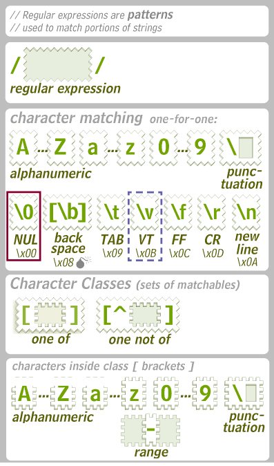
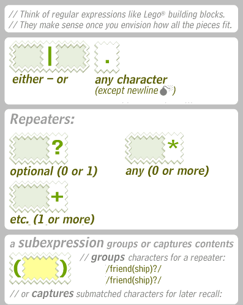

## Ejemplo: quiero saber cuáles de las 170 secuencias de interés se encuentran en uno de los 10 conjuntos de datos

Supongamos que es un análisis conocido y estandarizado, que se resuelve
con los siguientes
    commandos:

    bin/get_seq seq/secuencia.txt data/datos.fastq > results/secuencia@datos.fastq.extras
    bin/clean_seq results/secuencia@datos.fastq.extras > results/secuencia@datos.fastq

. . .

Entonces sólo ejecutamos esos comandos 1700
veces.

## Ejercicio 1 ¿La secuencia P\_49627 se encuentra en el conjunto de datos C2?

. .
    .

    bin/get_seq seq/P_49627.txt data/C2.fastq > results/P_49627@C2.fastq.extras
    bin/clean_seq results/P_49627@C2.fastq.extras > results/P_49627@C2.fastq

## `mk` es una herramienta para automatizar trabajos


## `mk` requiere un archivo de configuración que tiene la forma

`objetivo($target):ATTRIBUTOS: ingredientes($prereq)`  
`<tab> receta(instrucciones)`

Se usa  para indicar los comandos de una *receta*.

Por defecto `mk` hace
.

## Una analogía para entender `mk`: `mk` es el cocinero, `mkfile` el recetario

`mk` hace las cosas que le dices.

`mkfile` tiene las instrucciones para
hacerlas.

## Para hacer un mk tenemos que tener claro el platillo y los ingredientes

  - Nombrar el platillo (\(target) y los ingredientes (\)prereq).

\<algo\> asado:

    $ cat mkfile
    results/%.asado:    data/%

## Luego se agrega la receta

    $ asar --con-pimienta pato > pato.asado
    #
    # se vuelve:
    #
    $ cat mkfile
    results/%.asado:    data/%
        asar --con-pimiemta $prereq > $target

## Y finalmente podemos usar el recetario

    mk results/pato.asado

## Ejercicio 2: ¿Cuál es el platillo y el ingrediente para encontrar la secuencia P\_49627 en el conjunto de datos C2?

¿La secuencia P\_49627 se encuentra en el conjunto de datos
    C2?

    bin/get_seq seq/P_49627.txt data/C2.fastq > results/P_49627@C2.fastq.extras
    bin/clean_seq results/P_49627@C2.fastq.extras > results/P_49627@C2.fastq

<!--
```
$ cat mkfile
results/P_49627@C2.fastq:   results/P_49627@C2.fastq.extras

results/P_49627@C2.fastq.extras:    seq/P_49627.txt data/C2.fastq
```
-->

## Ejercicio 3: rellenar las instrucciones de la receta para encontrar el resultado

Sabremos que funciona porque tendremos el resultado correcto al
ejecutar

    mk results/P_49627@C2.fastq

# Ejercicio 4: En cada una de la receta ¿Cuál es el platillo que estamos preparando (\(target)? ¿Cuáles son los ingredientes (\)prereq)?

Reemplazar dentro de la receta, el platillo y los ingredientes por
variables

    $ cat mkfile
    results/P_49627@C2.fastq:   results/P_49627@C2.fastq.extras
        bin/clean_seq results/P_49627@C2.fastq.extras > results/P_49627@C2.fastq
    
    results/P_49627@C2.fastq.extras:    seq/P_49627.txt data/C2.fastq
        bin/get_seq seq/P_49627.txt data/C2.fastq > results/P_49627@C2.fastq.extras

## Una receta puede hacerse general usando comodines

    $ asar --con-pimienta pato > pato.asado
    $ asar --con-pimienta bistec > bistec.asado
    $ asar --con-pimienta pollo > pollo.asado
    #
    # se vuelve:
    #
    $ cat mkfile
    results/%.asado:    data/%
        asar --con-pimiemta $prereq > $target

## Ejercicio 5: Hacer que el objetivo final `.fastq` sea general:

    $ cat mkfile
    results/P_49627@C2.fastq:   results/P_49627@C2.fastq.extras
        bin/clean_seq "${prereq}" > "${target}"
    
    results/P_49627@C2.fastq.extras:    seq/P_49627.txt data/C2.fastq
        bin/get_seq ${prereq} > "${target}"

## Para hacer general el estado intermedio necesitamos un lenguaje para expresar patrones de texto

El lenguaje se llama «Expresión regular»

 


## Ejercicio 6 (regexp): Seguir las instrucciones para cambiar las variables por expresiones regulares

    $ cat mkfile
    results/%.fastq:    results/%.fastq.extras
        bin/clean_seq "${prereq}" > "${target}"
    
    results/P_49627@C2.fastq.extras:    seq/P_49627.txt data/C2.fastq
        bin/get_seq ${prereq} > "${target}"

## Se le puede decir a mk que haga muchas cosas a la vez

    mk results/P_5029@D2.fastq results/P_5029@B1.fastq \
       results/P_5029@D1.fastq results/P_5029@B2.fastq \
       […] # otros 1696 objetivos

## Por comodidad hacemos un script que haga de mesero y le diga a mk todo lo que tiene que cocinar

    bin/targets | xargs mk

# Errores comunes

## Ejercicio 2 (dónde):

Ejecutar `mk results/P_49627@C2.fastq`

¿Hay un error? ¿Cómo se corrige?

## Ejercicio 3 (permisos):

Ejecutar `mk results/P_49627@C2.fastq`

¿Hay un error? ¿Cómo se corrige?

## Ejercicio 5 (nombre):

Ejecutar `mk results/P_49627@C2.fastq`

¿Hay un error? ¿Cómo se corrige?

## Tomar las órdenes (bin/targets).

    $ cat bin/targets
    #!/bin/sh
    find -L data \
        -type f \
    | sed -r \
        -e 's#^../#results/#' \
        -e 's#$#.asado#'

# Problemas comunes

## Permisos

Si la compu dice `Permission denied`:

    chmod +x [archivos]
    chmod +r [archivos]
    chmod +w [directorio]

## Archivos vacíos

En caso de que sean correctos, ignorarlos:

    $ cat bin/targets
    #!/bin/sh
    find -L data \
        -type f \
        '!' -empty \
    | sed -r \
        -e 's#^../#results/#' \
        -e 's#$#.asado#'

## Archivos vacíos o truncos

En caso de que esto sea incorrecto, repetir el análisis.

## Nombres de archivo con caracteres especiales

    $ cat bin/targets
    #!/bin/sh
    find -L data \
        -type f \
    | sed -r \
        -e 's#^../#results/#' \
        -e 's#$#.asado#'

## Comandos incorrectos

    mk -dep

Ejecutar el comando y corregirlo.

## El programa no está en la ruta (`PATH`)

Si el programa que estás usando no tiene la ruta

    env PATH=$PATH:/usr/lib/plan9/bin mk 

# mk

## Estructura de directorios

    $ tree
    ./
    ├── mkfile
    ├── bin/
    │   ├── targets
    │   └── otros-scripts...
    ├── ../
    │   └── pato
    └── results/
        └── pato-a-la-naranja
    
    3 directories, 5 files

`bin/targets` son las órdenes de los clientes.
