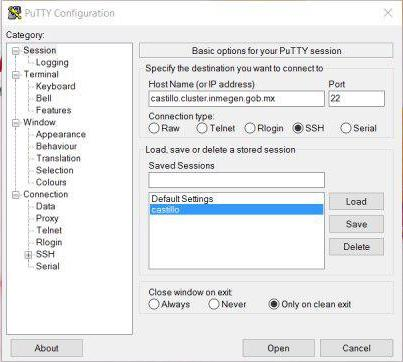

# OpenSSH


[**OpenSSH**](https://www.openssh.com/) (Open Secure Shell) o **ssh** es un conjunto de herramientas para la comunicación segura entre computadoras usando el protocolo [**SSH**](https://www.ssh.com/ssh/protocol/). **OpenSSH** fue desarrollado como alternativa libre y de código abierto a la implementación SSH propietaria.
**OpenSSH** es en realidad un conjunto de programas que ofrecen una gran variedad de capacidades de hacer túneles seguros, muchos modos de autenticación y opciones de configuración sofisticada.

__¡Vamos a conectarnos @ROGUE1!__

Conéctate a esta dirección:

<p align="center"> 
<big><tt>castillo.cluster.inmegen.gob.mx</tt></big>
</p>


o, lo que es lo mismo, a esta IP:

<p align="center"> 
<big><tt>192.168.105.221</tt></big>
</p>


### Si estás en GNU/Linux o MacOSX

 
1. Abre la terminal. 
  - Si estás en GNU/Linux `Ctrl`+`Alt`+`T`. 
  - Si estás en MacOSX `cmd`+`space` y luego teclea `terminal`+`↩︎`.

2. Teclear lo que sigue sustituyendo \<usuario> por tu nombre de usuario:
	
	```
	$ ssh <usuario>@castillo.cluster.inmegen.gob.mx
	```

3. Teclea tu contraseña (parecerá que no se está escribiendo nada) y da enter de nuevo

### Si estás en Windows

1. Abre PuTTY y escribe la dirección en el campo que dice "Host Name (or IP address)"

	```
	castillo.cluster.inmegen.gob.mx
	```
	
	

2. Clickea en `Open` (puede tardar unos segundo).

3. En la terminal que se abre, teclea tu nombre de usuario, da `enter`. 

4. Teclea tu contraseña (parecerá que no se está escribiendo nada) y da `enter` de nuevo.


<p align="center">
<big><b>¡Ya estas usando el Clúster del INMEGEN!</b></big>
</p>


## Byobu

[Byobu](http://byobu.co/) es un multiplexador de terminal. Sirve, entre otras cosas, para proteger el trabajo que hacemos en el cluster de posibles desconecciones inesperadas desde nuestra terminal. 
 

```
$ byobu
```

¿Notaron que de lindo es? ;¬)

Algunos atajos de teclado importantes de Byobu son:

`F2` Crea una nueva ventana dentro de byobu

`F3` Cambia a la ventana anterior

`F4` Cambia a la ventana siguiente

`F6` Despégate de esta sesión 

Más atajos de teclado [aquí](http://byobu.co/documentation.html).


Veamos que podemos hacer aquí. Ve a la siguiente presentación:


<p align="center"> 
<big><b><a href="linea_de_comandos.md">Interface de línea de comandos</a></b></big>
</p>


Salimos de Byobu.

```
$ exit
```

Cerramos la coneción SSH

```
$ exit
```


## rsync

[rsync](https://rsync.samba.org/) es una utilidad para la transferencia y sincronización eficiente  de archivos a travez de sistemas de cómputo. rsync se usa típicamente para sincronizar archivos y directorios entre dos sistemas distintos.

Sintaxis general:

```
rsync [OPTION] … SRC … [USER@]HOST:DEST
rsync [OPTION] … [USER@]HOST:SRC [DEST]
```

Por ejemplo


```
$ cd
$ rsync -avz <usuario>@castillo.cluster.inmegen.gob.mx:datos.taller .
```


## SSHFS

[SSHFS](https://github.com/libfuse/sshfs) es un sistema de GNU/Linux (y otros sistemas operativos, como MacOSX o FreeBSD, gracias a la implementación FUSE) Desde una terminal parada en nuestra computadora

**En Linux:**

+ **[sshfs](http://fuse.sourceforge.net/sshfs.html)**  [(Tutorial)](https://www.digitalocean.com/community/tutorials/how-to-use-sshfs-to-mount-remote-file-systems-over-ssh)

```
$ sudo apt install sshfs
```

**En Mac:**

+ **[SSHFS](https://github.com/libfuse/sshfs/releases)**

+ **[OSXFuse](https://osxfuse.github.io/)**

**En Windows:**

+ **[win-sshfs](https://code.google.com/p/win-sshfs/)**


### Demostación:

```
$ cd
```

```
$ mkdir rogue1
```

```
$ sshfs <usuario>@castillo.cluster.inmegen.gob.mx: ~/rogue1 -o local -o volname=ROGUE1 
```

En GNU/Linux:

```
$ sshfs <usuario>@castillo.cluster.inmegen.gob.mx: ~/rogue1 
```


Busca tu disco ROGUE1.

Para desmontar:

```
$ fusermount -u ~/rogue1
```

En Mac:

```
$ umount -u ~/rogue1
```

O bien expulsa como siempre haces con un dispositivo externo.